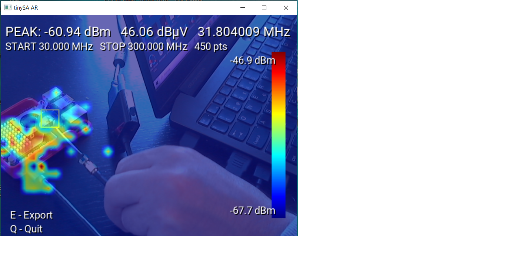

# tinySA AR Field Probe – Augmented Reality RF Mapping Tool

This project provides an augmented-reality system for visualizing and mapping RF emissions using the **tinySA / tinySA-Ultra spectrum analyzer**.  
https://www.tinysa.org/wiki/
It generates a real-time RF heatmap overlaid on the live camera image, synchronized with the position of a physical near-field probe tracked via computer vision .

![Screenshot] (tinysa_export_20251120_170612.png )

---

## Overview

The tool is designed for **EMI/EMC near-field investigation**, using typical low-cost **H-field and E-field probes**, such as:  
- https://www.alibaba.com/product-detail/Near-field-Magnetic-Field-Probe-EMC_1600875914138.html  
- https://pt.aliexpress.com/item/32948421683.html?gatewayAdapt=glo2bra
  
By combining the tinySA-Plus measurements with AR visualization, the system allows users to correlate probe position with the measured signal strength directly on screen. All readings are converted into **dBm** and **dBµV**, and can be exported for documentation or analysis.
Testing was performed using a **Logitech C270 webcam mounted on a tripod**, providing a stable viewpoint that ensures reliable AR tracking and consistent heatmap generation. This tool enables rapid RF noise diagnostics, identification of emitting components, and intuitive visualization of emissions in electronic prototypes, being especially useful during debugging stages, pre-compliance evaluations, and informal laboratory analysis

---Before running tinysa_ar_fieldProbe.py, install the required Python libraries with pip install opencv-python pyserial numpy pillow. 

## 🚀 Features

### 🔍 Augmented Reality Interface
- Real-time RF heatmap over live video  
- Automatic CSRT probe tracking  
- Dynamic color scale  
- Professional-style HUD display  

### 📡 tinySA / tinySA-Plus Integration
- Automatic sweep detection  
- Real-time peak reading (dBm, dBµV)  
- Frequency tracking  
- 40×30 spatial heatmap grid  

### 📤 Export Options
- PNG image with full AR overlay  
- CSV file containing:
  - timestamp  
  - dBm  
  - dBµV  
  - frequency (Hz)  
  - grid coordinates (x, y)

---
## Credits

This project was developed by Paulo Onofre.  
AI assistance provided by ChatGPT (OpenAI) for code generation and optimization under the author's guidance.

